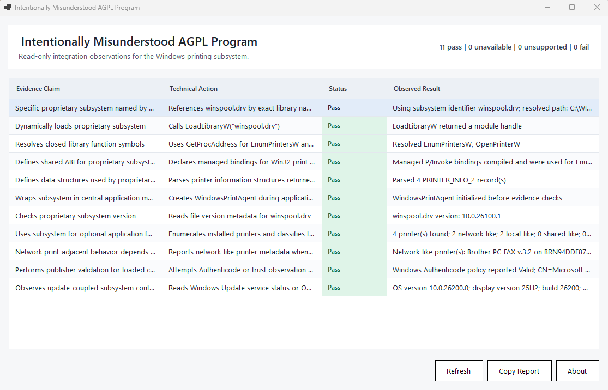
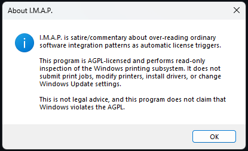
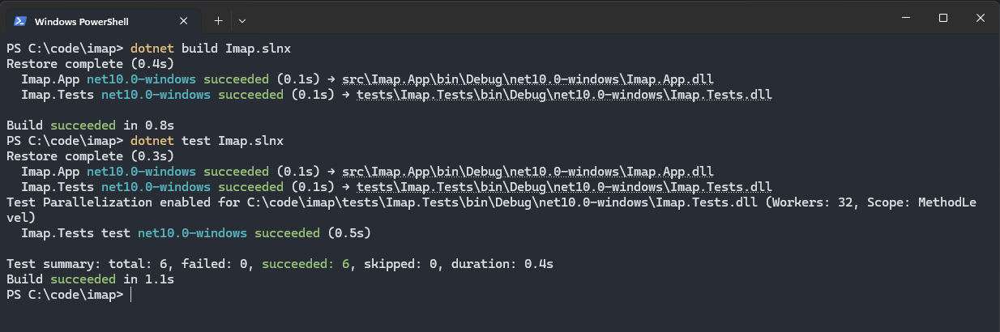
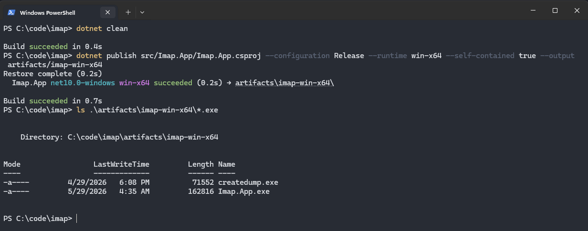

# I.M.A.P.: Intentionally Misunderstood AGPL Program

[](https://github.com/xiaodown/imap/actions/workflows/build.yml)

I.M.A.P. stands for **Intentionally Misunderstood AGPL Program**.

It is a deliberately deadpan Windows desktop application that
demonstrates how sloppy technical/legal reasoning about AGPL software can reach
absurd conclusions.

I.M.A.P. is an AGPL-licensed Windows program that integrates with the
proprietary Windows printing subsystem. It intentionally performs real
integration patterns that resemble claims sometimes made in arguments that "a
closed component must become AGPL merely because an AGPL program integrates with
it."

The point is not that Microsoft is violating the AGPL. The point is the exact
opposite: if the same mechanical checklist of "evidence" were applied here, it
would produce an obviously absurd result.

<p align="center">
  
  
</p>


## Why this exists / Bambu Lab context

Bambu Lab sent a pretty petty communication to user jarczakpawel regarding his
Orca Slicer fork that included a workaround for some of the network restrictions
that Bambu Lab has imposed recently.  This wasn't a cease-and-desist, but it was
a "stop doing that or we will send you a cease-and-desist", and I think Bambu Lab
should have handled this better.  This is not a good luck for them.

Having said that, the counter-claims that Bambu Lab is violating the AGPL because
the `bambu_networking` plugin is proprietary and yet deeply integrated with
Bambu Studio, in my opinion, are very silly.  I am not a lawyer, but it would
seem to me that the so-called "deep integration" is just normal functionality
for using any plugin in pretty much any context.

Bambu Studio remains functional without the `bambu_networking` plugin.  The plugin
is not required, whereas the AGPL says:

> You may convey a covered work in Object Code form […] provided that you also convey the machine-readable Corresponding Source under the terms of this License […]   
>      
> Corresponding Source includes interface definition files associated with source files for the work, and the Source Code for shared libraries and dynamically linked subprograms that the work is specifically designed to require […]     

And from looking at the Bambu Studio code, it is my opinion that Bambu Studio is 
specifically written *not to require* the networking plugin.  The argument that 
Bambu Lab is violating the AGPL, in my opinion, seems to boil down to:

### "Bambu Studio is open source, and Bambu Studio does a bunch of specific things to integrate with this plugin, therefore the plugin is part of Bambu Studio"

The published piece [Why bambu_networking violates the AGPL in Bambu Studio](https://github.com/jarczakpawel/OrcaSlicer-bambulab/blob/main/bambu_agpl.md) contains
a number of points that ostensibly explain why Bambu Studio is in violation of
the AGPL; however, it is my opinion that none of these are obviously and unambiguously valid.

So, I had the idea to write a program, licensed with the AGPL, that accomplishes 
as many of these points as is reasonable for me to vibe-code in one evening, that 
integrates with a closed source interface, in order to "prove" (hyperbole) that 
just because an AGPL'd program contains references to, and links deeply with, 
proprietary code, that does not mean that the AGPL then virally attaches to 
whatever the proprietary code is.

The most absurd way I could think to "demonstrate" this is to write something that
integrates with Windows.  I chose the printer subsystem because, well, Bambu Lab
does printers.  And I thought it'd be funny.  

## Things I already know

I know that this is not a 1:1 comparable scenario to the Bambu Lab / OrcaSlicer-bambulab
drama.  I know that it is absurd.  I know that it proves nothing.  I know that the 
code is bad, and I know nothing about C# or .NET, and that it's obvious that AI
wrote most of it.

I already know all of that.  You don't have to tell me.

## What This Is

I.M.A.P. is a small Windows desktop status viewer. It looks 
like a boring compliance report or diagnostic tool. On launch, it will run a series of
read-only checks against Windows printing APIs and display a checklist of
results.

Example categories:

- The AGPL app references a specific proprietary subsystem by name.
- The AGPL app dynamically loads a proprietary DLL.
- The AGPL app resolves function symbols from that DLL.
- The AGPL app defines ABI bindings and structs used to communicate with that
  subsystem.
- The AGPL app wraps the subsystem in an application service object at startup.
- The AGPL app gates some optional behavior on whether that subsystem exists.
- The AGPL app checks subsystem version information.
- The AGPL app performs publisher/signature validation.
- The AGPL app performs update-adjacent read-only inspection.

Those are all normal software integration patterns. They may be facts in a real
licensing analysis, but they are not magic license-contamination triggers by
themselves.

## What This Is Not

This project is not legal advice.

This project does not claim that Microsoft violates the AGPL.

This project is not an attempt to evade software licenses. It is a commentary
tool about bad reasoning around software licenses.

## Implementation

- Platform: Windows 10/11
- Language: C#
- Framework: .NET 10
- UI: WinForms
- License: AGPL-3.0-or-later
- Main project: `src/Imap.App`
- Tests: `tests/Imap.Tests`

Build and test from a Windows environment:

```powershell
dotnet build Imap.slnx
dotnet test Imap.slnx
```

<p align="center">
  
</p>

Run the app:

```powershell
dotnet run --project src/Imap.App
```

Create a self-contained Windows x64 build:

```powershell
dotnet publish src/Imap.App/Imap.App.csproj --configuration Release --runtime win-x64 --self-contained true --output artifacts/imap-win-x64
```

<p align="center">
  
</p>

## Known Limitations

Publisher observation (comparable to *"18. Default publisher validation further ties the plugin to the application"*) 
uses read-only `WinVerifyTrust` validation for
`winspool.drv`. If the file is catalog-signed rather than embedded-signed, the
app falls back to Windows PowerShell's built-in `Get-AuthenticodeSignature`
cmdlet. If that fallback is unavailable, the row reports `Unsupported`.

## Promise of safety

The app never submits print jobs, modifies printer configuration, installs
drivers, changes services, or triggers Windows Update.  It is strictly read-only.

## Releases

The release artifact is a self-contained build, so you do not need to install
.NET separately.
